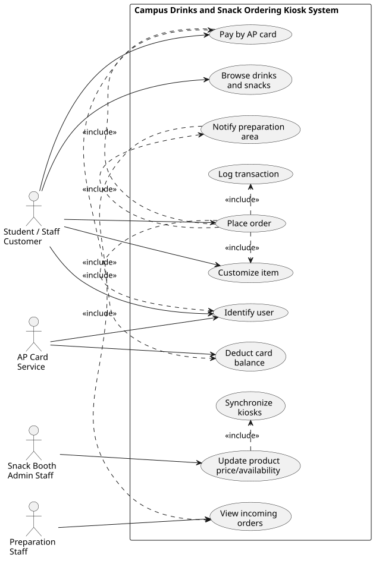
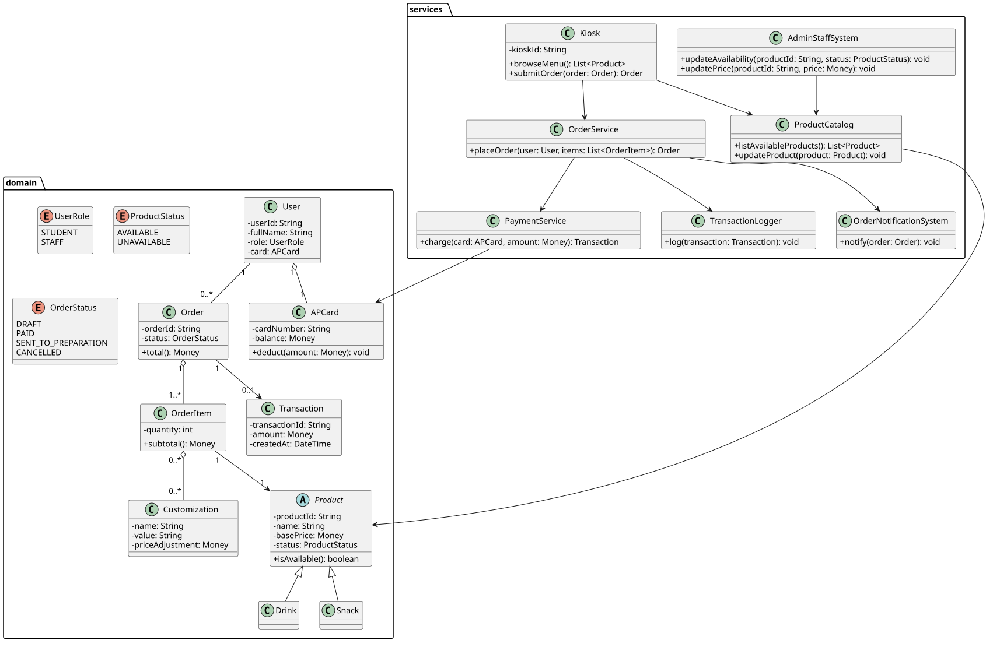
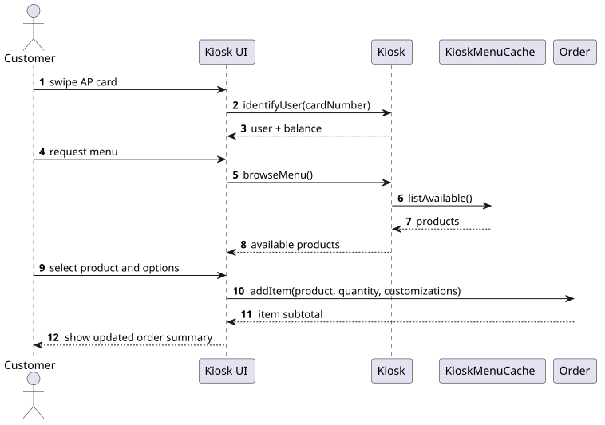
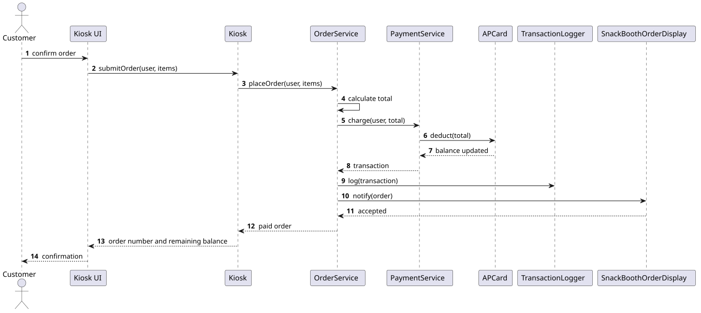
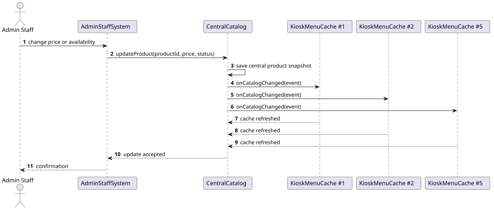
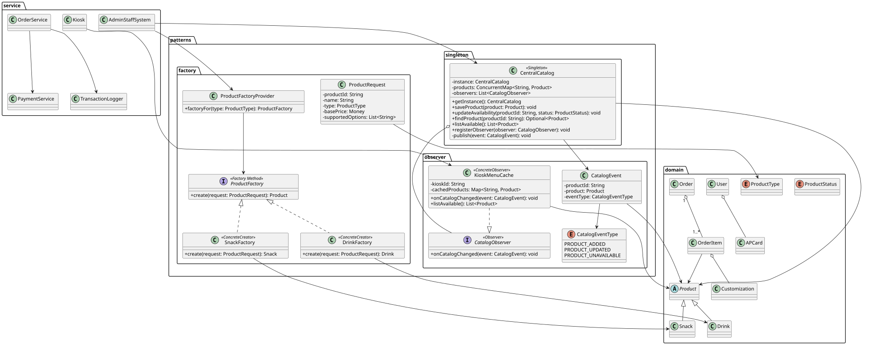
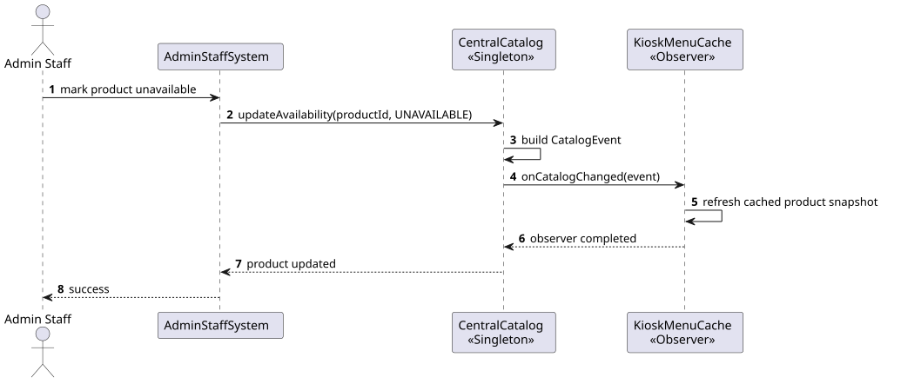
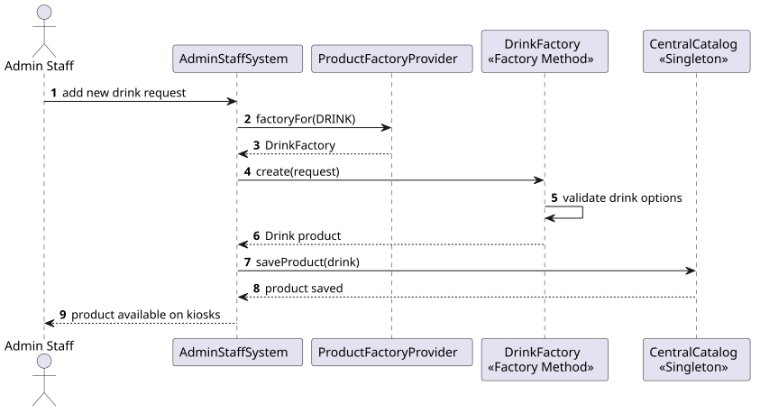
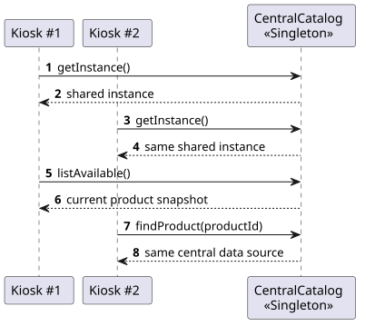

# Rendered UML Diagrams

This file gathers all rendered UML diagrams in one place. The source files are in `diagrams/plantuml`, and the generated SVG images are in `diagrams/rendered`.

Regenerate the images with:

```bash
node tools/render-diagrams.mjs
```

## 1. Use Case Diagram



Source: [`01-use-case.puml`](../diagrams/plantuml/01-use-case.puml)

## 2. Initial Class Diagram



Source: [`02-class-initial.puml`](../diagrams/plantuml/02-class-initial.puml)

## 3. Browse and Customize Sequence



Source: [`03-sequence-browse-customize.puml`](../diagrams/plantuml/03-sequence-browse-customize.puml)

## 4. Place Order and Payment Sequence



Source: [`04-sequence-place-order-payment.puml`](../diagrams/plantuml/04-sequence-place-order-payment.puml)

## 5. Admin Product Update Sequence



Source: [`05-sequence-admin-update.puml`](../diagrams/plantuml/05-sequence-admin-update.puml)

## 6. Refined Class Diagram With Patterns



Source: [`06-class-refined-patterns.puml`](../diagrams/plantuml/06-class-refined-patterns.puml)

## 7. Observer Catalog Synchronization Sequence



Source: [`07-sequence-observer-catalog-sync.puml`](../diagrams/plantuml/07-sequence-observer-catalog-sync.puml)

## 8. Factory Product Creation Sequence



Source: [`08-sequence-factory-product-creation.puml`](../diagrams/plantuml/08-sequence-factory-product-creation.puml)

## 9. Singleton Catalog Access Sequence



Source: [`09-sequence-singleton-catalog-access.puml`](../diagrams/plantuml/09-sequence-singleton-catalog-access.puml)

